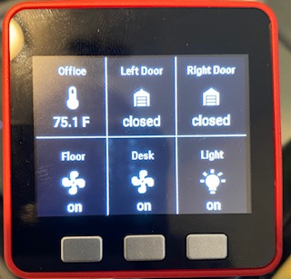

# esphome-homepoint
## Description
Utilize M5Stack Fire, ESPHome, and Node-Red to implement Homepoint to monitor the states of wanted entity and/or controls the entity from M5Stack.

## Resources
  - Link for [ESPHome](https://esphome.io/index.html)
  - Link for [ESPHome Addon](https://www.home-assistant.io/integrations/esphome/)
  - Link for [Home Assistant](https://www.home-assistant.io/)
  - Link for [Node-Red Addon](https://community.home-assistant.io/t/home-assistant-community-add-on-node-red/55023)
  - Link for [MDI Icons](https://pictogrammers.github.io/@mdi/font/5.4.55/)
  - Link for [Homepoint](https://github.com/sieren/Homepoint)

## Example photo


## Node-Red Configuration
By using the events:state block and passing onto the MQTT out to publish the message.

## M5Stack ESPHome YAML File
Font component obtained from [MDI Icon set](https://pictogrammers.github.io/@mdi/font/5.4.55/):

Add "\U000" before the code in glyphs.

```yaml
font:
  - file: "./fonts/Roboto-Medium.ttf"
    id: my_font_15
    size: 15
  - file: "./fonts/Roboto-Medium.ttf"
    id: my_font_20
    size: 20
  - file: "./fonts//materialdesignicons-webfont.ttf"
    id: icon_font
    size: 40
    glyphs: [
      "\U000F050F",  # mdi-thermometer
      "\U000F0335",  # mdi-lightbulb
      "\U000F06D9",  # mdi-garage
      "\U000F10AF",  # mdi-door-closed-lock
      "\U000F0210",  # mdi-fan
      "\U000F06DA",  # mdi-garage-open
      "\U000F081D",  # mdi-fan-off
      "\U000F06E8",  # mdi-lightbulb
      "\U000F081C"   # mdi-door-open
      ]     
```

Dispolay Component:

As now, six components can be shown in the single screen, same as how Homepoint is configured.

```yaml
display:
  - platform: ili9341
    id: m5stack_display
    model: M5Stack
    cs_pin: 14
    dc_pin: 27
    led_pin: 32
    reset_pin: 33
    rotation: 0
    pages:
      - id: page1
        lambda: |-
          it.line(0,120,320,120);
          it.line(106.6666,0,106.6666,240);
          it.line(213.3333,0,213.6666, 240);
          
          it.rectangle(1,121,105.6666,240-3);
          it.rectangle(2,120+2,106.6666-2,240-4);
          
          it.line(0,240-1,106.6666-1,240-1);
          it.line(0,240-2,106.6666-1,240-2);
                  
          it.printf(55, 20, id(my_font_15), TextAlign::CENTER, "Front Door");
          
          if (id(mysensor).state == "locked") {
            it.printf(55, 60, id(icon_font), TextAlign::CENTER, "\U000F10AF");
          }else{
            it.printf(55, 60, id(icon_font), TextAlign::CENTER, "\U000F081C");
          }
          
          it.printf(25, 85, id(my_font_20), "%s", id(mysensor).state.c_str());
          
          it.printf(55+106.6666, 20, id(my_font_15), TextAlign::CENTER, "Left Door");
          
          if (id(leftGarage).state == "closed") {
            it.printf(55+106.6666, 60, id(icon_font), TextAlign::CENTER, "\U000F06D9");
          } else{
            it.printf(55+106.6666, 60, id(icon_font), TextAlign::CENTER, "\U000F06DA");
          }
          
          it.printf(25+106.6666, 85, id(my_font_20), "%s", id(leftGarage).state.c_str());
          
          if (id(rightGarage).state == "closed") {
            it.printf(55+106.6666*2, 60, id(icon_font), TextAlign::CENTER, "\U000F06D9");
          } else {
            it.printf(55+106.6666*2, 60, id(icon_font), TextAlign::CENTER, "\U000F06DA");
          }
          
          it.printf(55+106.6666*2, 20, id(my_font_15), TextAlign::CENTER, "Right Door");
          it.printf(25+106.6666*2, 85, id(my_font_20), "%s", id(rightGarage).state.c_str());
          
          it.printf(55, 10+130, id(my_font_15), TextAlign::CENTER, "Living Rm");
          it.printf(55, 50+130, id(icon_font), TextAlign::CENTER, "\U000F0335");
          it.printf(55, 95+130, id(my_font_20), TextAlign::CENTER, "OFF");
          
          it.printf(55+106.6666, 10+130, id(my_font_15), TextAlign::CENTER, "Living Rm");
          it.printf(55+106.6666, 50+130, id(icon_font), TextAlign::CENTER, "\U000F0335");
          it.printf(55+106.6666, 95+130, id(my_font_20), TextAlign::CENTER, "Stella");
          
          it.printf(55+106.6666*2, 10+130, id(my_font_15), TextAlign::CENTER, "Living Rm");
          it.printf(55+106.6666*2, 50+130, id(icon_font), TextAlign::CENTER, "\U000F0335");
          it.printf(55+106.6666*2, 95+130, id(my_font_20), TextAlign::CENTER, "ON");
```

Text sensor component:
```yaml
text_sensor:
  - platform: mqtt_subscribe
    name: "Data from topic"
    id: mysensor
    topic: the/topic
  - platform: mqtt_subscribe
    name: "Left Garage Door"
    id: leftGarage
    topic: garage/left
  - platform: mqtt_subscribe
    name: "Right Garage Door"
    id: rightGarage
    topic: garage/right
  - platform: mqtt_subscribe
    name: "Office Temp"
    id: officeTemp
    topic: office/temp
  - platform: mqtt_subscribe
    name: "Office Floor Fan"
    id: floorFan
    topic: office/floorFan
  - platform: mqtt_subscribe
    name: "Office Temp"
    id: deskFan
    topic: office/deskFan
  - platform: mqtt_subscribe
    name: "Office Light"
    id: officeLight
    topic: office/light
```
M5Stack Specific Buttons (A, B, and C)
```yaml
# Button to toggle the display backlight
binary_sensor:
  - platform: gpio
    id: M5_BtnB
    pin:
      number: 38
      inverted: true
    on_click:
      - if:
          condition:
            display.is_displaying_page: page1
          then:
            - homeassistant.service:
                service: scene.turn_on
                data_template:
                  entity_id: scene.livingroom_light_off
      - if:
          condition:
            display.is_displaying_page: page2
          then:
            - homeassistant.service:
                service: scene.turn_on
                data_template:
                  entity_id: scene.livingroom_light_11pm
      - if:
          condition:
            display.is_displaying_page: page3
          then:
            - homeassistant.service:
                service: scene.turn_on
                data_template:
                  entity_id: scene.livingroom_light_sunset_on
                  
  - platform: gpio
    id: M5_button_A
    pin:
      number: 39
      inverted: true
    on_click:
      then:
        - display.page.show_previous: m5stack_display
        - component.update: m5stack_display
  - platform: gpio
    id: M5_button_C
    pin:
      number: 37
      inverted: true
    on_click:
      then:
        - display.page.show_next: m5stack_display
        - component.update: m5stack_display
```
